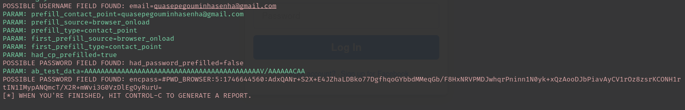
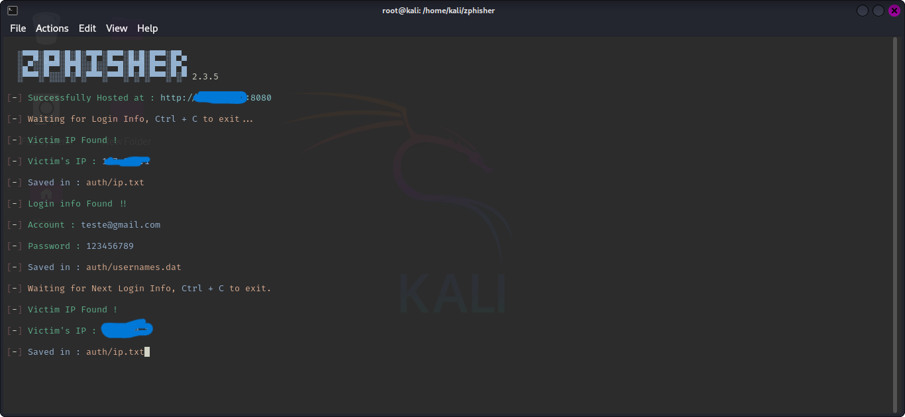

# Phishing para captura de senhas do Facebook
---
#### *Ferramentas*
- Kali Linux
- setoolkit
----
### Configurando o Setoolkit no Kali Linux
- Acesso root: ***sudo su***
- Iniciando o setoolkit: setoolkit
- Tipo de ataque: Social-Engineering Attacks
- Vetor de ataque: Web Site Attack Vectors
- Método de ataque: Credential Harvester Attack Method 
- Método de ataque: Site Cloner
- Obtendo o endereço da máquina: localhost
- URL para clone: http://www.facebook.com
---
### Configurando o Zphisher
- Acesso root: sudo su
- git clone https://github.com/htr-tech/zphisher.git
- Acessa a pasta com a ferramenta : cd zphisher
- Executando a ferramenta : bash zphisher.sh
----
### Resultados 

----

### Glossário:
- Phishing: Técnica de engenharia social utilizada para obter dados confidenciais, como senhas e informações bancárias, enganando a vítima com sites falsificados ou mensagens fraudulentas.

- Setoolkit: Ferramenta de pentest usada para realizar ataques de phishing e outras técnicas de engenharia social.(Ferranta mais Complexa)

- Zphisher:Zphisher: Ferramenta de código aberto mais simples e automatizada, utilizada em testes de phishing. Ideal para iniciantes, ela permite criar páginas falsas com poucos comandos, facilitando a aplicação de técnicas básicas de engenharia social.